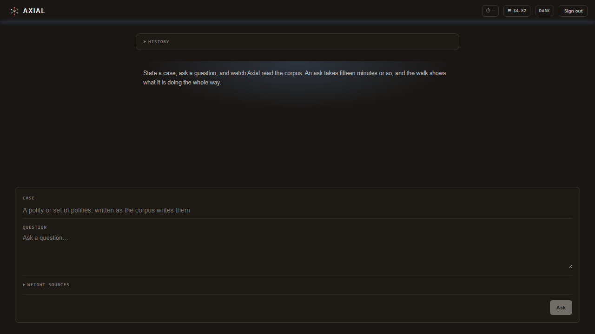
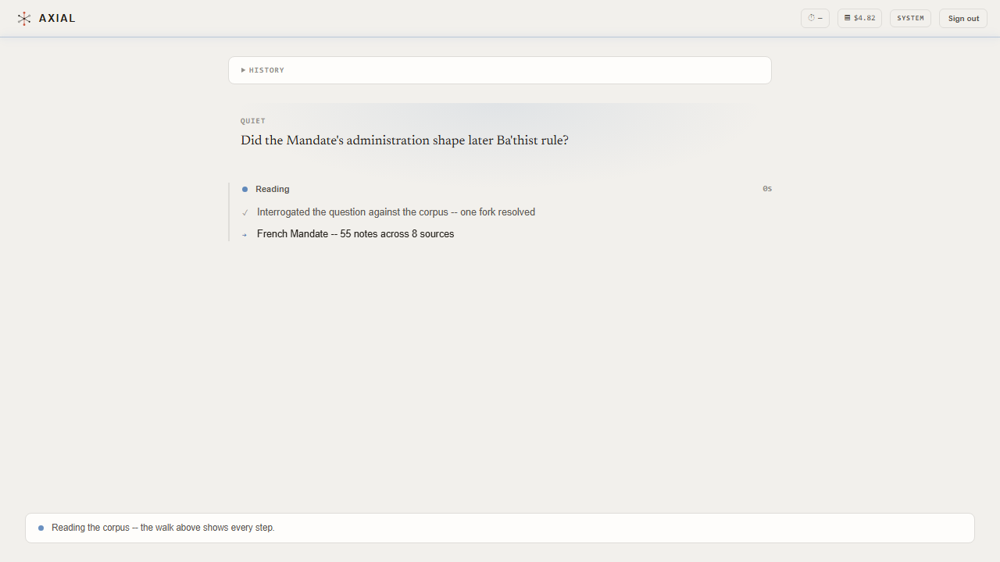

# Axial

)

Axial turns a corpus of born-digital academic books into original comparative-historical
scholarship. You hand it a case and a question; it returns an analysis, or a paper, in
which every claim is marked for what kind of claim it is, points at the passages that
ground it, and carries a disclosed confidence band.

This is the opposite of retrieval. A librarian returns what a source already said. Axial
reads every passage once with open questions (what it claims, whose position it is, who it
argues against, who it cites, what it names), lets passages meet each other at the names
they share, and states what follows from many sources read together. The claim no single
source made is the product, and it is also the risk, so that seam is labeled everywhere it
appears.

**v1.0.0, released 2026-08-12** — the first tagged release.

The corpus is comparative-historical political sociology, weighted toward Syria and the
surrounding literature: Mann, Kalyvas, Brubaker, Hinnebusch, Migdal, Skocpol, Tilly,
Wedeen, Malešević. The mechanism is domain-general, and no country-specific logic lives in
`src/`. The domain frame is data in `config/domains/<domain>/`, reaching the model as
context and examples, never as a gate. Porting to another literature is a config edit.

**The governing standard is not correctness. It is auditability.** A novel claim has no
answer key, so the constitution ([`specs/CHARTER.md`](specs/CHARTER.md)) enforces one
sentence instead: *accountability to grounds, with honest confidence.*

---

## The three phases

All three are built, run end to end, and measured.

| Phase | What it does | Input → output |
|---|---|---|
| **A. Corpus ingestion** | Ten stages: intake, structural extraction, routing, envelope, chunking, artifacts, interrogate, reconcile, materialize, gather | PDF/DOCX → an Obsidian vault of passages and name pages |
| **B. Analysis engine** | Brief interrogation, an LLM-free query API, an agentic retrieval loop, synthesis, five deterministic validators | a question → a structured analysis record and markdown answer |
| **C. Paper authorship** | Brief intake, arc planning, section-by-section drafting, citation indexing, apparatus | analysis records → a paper record and rendered paper |

Specs: [`specs/PRODUCT.md`](specs/PRODUCT.md) (A) · [`specs/PHASE-B.md`](specs/PHASE-B.md) ·
[`specs/PHASE-C.md`](specs/PHASE-C.md). The 69-row decision log is
[`docs/DECISIONS.md`](docs/DECISIONS.md). GitHub issues and PRs are the system of record.

**Reports:** [muhanad-husn.github.io/axial](https://muhanad-husn.github.io/axial/) is a
three-panel page — the nine architecture plates, the research report, and the engineering
report — built from the same sources as
[`docs/ARCHITECTURE.md`](docs/ARCHITECTURE.md) and [`data/reports/`](data/reports/).

### How Phase A works

A structural tree is extracted **once per source**, persisted, and reused by every later
stage. Chunking is fully deterministic, with no embedding model and no generative call, and
it writes to disk before any inference spend, so passage quality is inspectable for free.
Then one model call per passage asks the open questions. Nothing is picked off a closed
vocabulary; the name layer is grown from what the corpus said, not decided in advance.

Links live on the name pages, not in the passages. Obsidian treats a link as bidirectional,
so the graph draws identically and the whole link layer is regenerable: a changed merge
rewrites a few hundred name pages instead of six thousand notes.

### Where the guarantees live

Gates sit **outside** the model's control. A model never grades its own output, and no
judged check runs on the same model family that produced what it judges.

- **Phase B.** Brief interrogation may bound or refuse a request before any spend, and
  post-pass validators check attribution, counter-position presence, and coverage. A failed
  mechanical check blocks release.
- **Phase C.** Four gates run on every paper: provenance integrity and counter-position
  presence, both mechanical and hard, plus two narrow judged checks on the grounding and
  the labeling of the paper's own new cross-source claims.
- **Offline.** A sealed-packet reviewer panel measures argument coherence on a sample.
  Reviewers see the rendered output and the resolved text of every cited passage, and
  nothing else. The panel's numbers count for nothing until it catches deliberately planted
  defects.

---

## Where it stands

### The corpus, measured 2026-08-06

| | |
|---|---:|
| Sources ingested | 35 |
| Passages | 6,842 |
| Name pages | 47,584 |
| Name mentions | 137,276 |
| Pages that can carry a comparison | 329 |

A page carries a comparison when it holds roughly 30 to 200 passages drawn from five or
more books. Below thirty there is too little, above two hundred no reader can hold it, and
under five books it is one author talking. 329 of 47,584 pages clear that bar, seven in ten
thousand. Full report: `data/reports/axial-coverage-v2.md`.

### What a run costs

| Operation | Measured |
|---|---|
| Interrogate one passage | $0.0021 |
| Add 3 books to a 31-book corpus, map rebuilt | ~$10.26, zero failures |
| One analysis, over a nine-brief sweep | $0.12 to $0.43; $2.57 for nine |
| One paper | $0.08 to $0.20 |

Adding books does not re-ingest the corpus. Extract, envelope and chunk each skip on their
own artifact, and the incremental passes cut merge re-asks from 5,143 to 2,202 and map
reads from 665 to 148.

### The release bar

Both dev papers pass all four Phase C gates, on two separate builds:

| Gate | Metric | Value |
|---|---|---|
| provenance-integrity | `provenance_completeness` | 1.0000 (n=215) |
| provenance-integrity | `confidence_upgrade_count` | 0 (n=105) |
| counter-position | `paper_counter_position_presence_rate` | 1.0000 (n=2) |
| paper-grounding | `b_claim_noncontradiction_rate` | 1.0000 (n=5) |
| paper-attribution-fidelity | `b_seam_mislabel_rate` | 0.0000 (n=32) |
| paper-attribution-fidelity | `c_seam_mislabel_rate` | 0.0000 (n=19) |

Twelve sealed reviewers, three per packet. The positive control passed unanimously: three
planted defects (a fabricated cause cited to an unrelated passage, a section replaced with
hand-waving, and a confidence band above the coverage the paper itself discloses as thin)
were all caught by all three reviewers. Reviewer spread was zero on seven of eight cells,
which is what makes the bands a measurement rather than a sorting.

**The honest caveat.** The research briefs and gold labels driving the answer-quality
evaluations were authored by frontier models playing scholarly personas, not by real
academics (DEC-29). Those figures measure the engine. They do not measure answer quality
against a real academic question, and they never will: that path is permanent, not a
placeholder.

---

## What measurement changed

Every one of these cost money to learn, and each is why some part of the code looks the way
it does.

- **Attributes are not edges.** v0 tagged passages on closed vocabularies and produced
  18,761 notes with 584 edges, all intra-book and bipartite by construction. No threshold
  could have fixed it. The design was rewritten around open interrogation and a grown name
  layer (DEC-55).
- **A green suite is not evidence.** Two runs of the artifact-role classifier over the same
  source disagreed on 48.5% of artifacts and flipped the keep/discard bit on 13.1%. The
  axis and its model call were deleted, and a caption-presence rule in code predicts that
  bit far better. Corpus-facing heuristics are now validated against real sources before
  promotion, never against fixtures alone.
- **Bibliographies were being cited as evidence.** Back matter was 8.1% of passages but
  14.2% of name answers. It is now cut structurally, by where a section sits in the book,
  read off the cached tree, with no heading vocabulary and no model call (DEC-58).
- **Retrieval was filtering bins that no longer existed.** Four of eight query tools
  returned zero results. After the rewrite over the name layer, ten of ten return (DEC-59).
- **Model self-agreement is the floor, not the finding.** Merge disagrees with itself on
  13.3% of large clusters, though every flip is a singular/plural or article variant and it
  moves 0.4% of the material. Gather fails to reproduce 36.1% of its own recorded
  disagreements on byte-identical input. Any before/after comparison needs a margin wider
  than that noise floor.
- **The reviewers found what the gates cannot.** Four of six independently diagnosed that
  the keystone Syrian claim in both papers is carried by Moroccan and Egyptian evidence.
  The corpus holds no Syria-specific passage on that mechanism, so the drafter argues by
  analogy. That is a corpus gap presenting as a citation defect, and no amount of retrieval
  work fixes it.
- **The argument map scales but densifies.** Growth is near-linear (k=1.04) while
  cross-book arguments went from 8.7% to 38.4% and are not plateauing. Selection becomes
  necessary somewhere near a hundred sources.

---

## Quick start

```bash
uv sync                 # Python 3.13+, uv
uv run pytest           # 3,515 tests
uv run axial --help
```

`uv run axial key set` writes an OpenRouter key to `secrets/secrets.toml`, and
`secrets.example.toml` shows the shape. `axial key check` spends one cheap call to prove it
works. Model tiering is per pass in config, never hardcoded.

A first pass over one source, then a question:

```bash
SRC=data/sources/mann-v2-1993.pdf
uv run axial intake      $SRC   # verify a real text layer
uv run axial extract     $SRC   # structural tree, persisted, reused by everything after
uv run axial envelope    $SRC   # what this book argues; threaded into every later call
uv run axial chunk       $SRC   # deterministic, zero model calls
uv run axial interrogate $SRC --limit 50   # read 50 passages before paying for the rest
uv run axial names build && uv run axial names merge && uv run axial names materialize
uv run axial names gather       # what the authors at each name disagree about
uv run axial ask                # state the case, ask, watch the walk, read the answer
```

`axial sources` does the whole ingestion arc over whatever is new in the configured
backend, a local folder or Google Drive, and skips what is already done.

### Command surface

| Command | Does |
|---|---|
| `schema` | inspect a domain frame, cross-check it against the codebook |
| `intake` · `extract` · `envelope` · `chunk` · `artifacts` | Phase A stages 1 to 5; chunking is LLM-free |
| `interrogate` | one open-question call per passage |
| `names build / merge / materialize / gather` | the inventory, the merge calls, the vault write, the disagreements |
| `map build` | the argument map: passages bagged by claim similarity, then read |
| `sources` · `ingest` · `run` · `drive` | batch and incremental corpus operations |
| `status` · `runs` | one screen of pipeline state; watch a live run |
| `ask` · `brief` | Phase B, as a session or from a brief file |
| `paper` | Phase C: plan, draft, render |
| `gate` · `panel` · `eval` · `gather-eval` · `distill` | the eval and gate harnesses |
| `pin` · `reconcile` · `polity` · `key` | corpus pins, orphan GC, canonical maps, credentials |

`uv run axial <command> --help` for the rest.

### Running it as a service

`docker compose up` stands up the service from one file: Postgres, the API, and the worker
that runs the ask, against a published corpus snapshot mounted read-only. Copy
`.env.example` to `.env` first; every setting either container reads is in there, and
[`docs/service-deployment.md`](docs/service-deployment.md) says what each one does. The
analyst web client is a separate deploy from [`web/`](web/README.md): Next.js, an ask
composer, the streaming walk, paper render and export, Supabase sign-in. For local operator
use without any of it, `axial console` opens a Streamlit console over the CLI, one user,
one machine, no auth.





---

## Repository layout

```
config/
  pipeline.yaml            providers, model-per-pass, paths
  domains/syria/           schema.yaml, codebook.yaml, polity_canonical.yaml
  briefs/ paper_briefs/    the smoke, eval and dev question sets
  lenses/                  theoretical lenses a brief can apply
src/axial/                 one module per stage, unit tests co-located
  intake extract router envelope chunk artifacts interrogate
  names merge_names materialize gather argmap
  query/ retrieve/ analyze/ brief/ answer/ ask/          Phase B
  paper/ distill/ panel/                                 Phase C
  gates/ validators/ eval/                               the gate harnesses
  operator/                                              the Streamlit console
web/                       the analyst web client: Next.js, TypeScript, Tailwind
tests/                     acceptance contracts, grouped by the stage they pin
evals/                     eval cases, corpus pins, and reports for the gate harnesses
experiments/               one-off measurement scripts, not part of the pipeline
plans/_archive/            the slice plans work was built from, kept as a record
specs/                     CHARTER.md, PRODUCT.md, PHASE-B.md, PHASE-C.md
docs/                      ARCHITECTURE.md, diagrams/, DECISIONS.md, eval/, _archive/,
                            service-deployment.md
data/                      gitignored: sources and every derived artifact
Dockerfile                 the analyst service image
docker-compose.yml         Postgres, the API and the worker, over a mounted snapshot
.env.example               the env shape docker compose expects
```

`data/` is gitignored in full and stays that way. The sources are in-copyright books and
every derived artifact carries verbatim passages of them (DEC-23).

---

## Tests and gates

3,515 tests across 238 Python files (`tests/` acceptance contracts plus co-located `src/`
unit tests). The `web/` client has its own suite: vitest unit tests plus Playwright
end-to-end specs against a mock service. Cost is proportional to blast radius:

- **Pre-commit.** The `src/` unit tier plus ruff, about six seconds. A red commit cannot
  land, and code cannot land directly on `main`.
- **CI.** The full pytest tree on every PR, sharded across three acceptance jobs plus a
  unit+lint job, as the required check. A separate `web` job runs lint, typecheck, unit
  tests, build, and Playwright.
- **Real-corpus validation.** Any corpus-facing heuristic is measured against
  `data/sources/` before promotion. This is a norm rather than a hook because a green suite
  has twice failed to catch a defect the corpus caught immediately.

Acceptance contracts live in `tests/`; inner unit tests sit beside the code they test under
`src/`.

---

## What's next

No open issues, and two future milestones.

The analyst service, the analyst web client and the operator console are built and
measured. The service (#681 to #686, #691) is a job store, FastAPI over it, progress
streaming as events rather than a spinner, a published corpus as a read-only SQLite
snapshot pinned to its build, identity on the request path, and quotas with a content-keyed
paper cache. The web client in `web/` (#687, #688, #690) is the application over it: an ask
composer, the streaming walk, paper render and export, per-analyst history and spend
meters, Supabase sign-in including Google, invitation-only. The operator console (#689) is
a local Streamlit console over the `axial` CLI, tailing the run log, one user, one machine,
no API and no auth. The whole stack stands up from one `docker compose up` (#691), and the
shipping image carries the ask path and nothing else: 592 MB, 72 packages, no GPU runtime
(#772).

**Built, not deployed** (DEC-65) still holds: the deliverable is a stack someone else can
stand up, with no founder path in the running service. Cost, copyright and quota are the
deployer's decisions, and at roughly $0.13 a paper they are real ones.

**[Phase D, format adaptation](https://github.com/Muhanad-husn/axial/milestone/1)** covers
venue conventions, house style, length targets, and citation style. Phases B and C push
styling work over that boundary.

**[Phase E, lens application](https://github.com/Muhanad-husn/axial/milestone/2)** is a
milestone, not a queued phase. Neither D nor E has a spec, a date, or an issue (DEC-63).

Nearer term, the corpus itself is the binding constraint. The coverage report names three
concept-level gaps (sovereignty, a critic of Mann, an answer to Chouliaraki and Agamben),
and the next book added should not be about Syria.

---

## How this repository is built

One operator, one AI engineering org. Work lands as a PR from a builder subagent working in
its own git worktree: acceptance test first, then code to green, spec updated in the same
change when behavior moves. Deterministic hooks hold the line. Subagents are blocked from
merging entirely, red commits are blocked, and code cannot reach `main` without a PR. The
human merges, and only the human.

1,024 commits, 408 merged PRs, 362 closed issues to date. Development is AI-assisted with
[Claude Code](https://claude.com/claude-code); architecture and approval authority are
human.

---

## License

[PolyForm Noncommercial 1.0.0](LICENSE). Use it, modify it, redistribute it, build on it,
for research, teaching, study, or any other noncommercial purpose. Charities, universities,
public research bodies and government institutions are covered regardless of how they are
funded. Commercial use needs a separate license; open an issue.

Two caveats. This is **source-available, not OSI open source**: the noncommercial
restriction is exactly what the OSI definition forbids, and calling it otherwise would be
inaccurate. And it licenses the *code* only. The books in `data/` are other people's
copyright, none of them ship here, and anything Axial produces from a corpus inherits that
corpus's terms.
