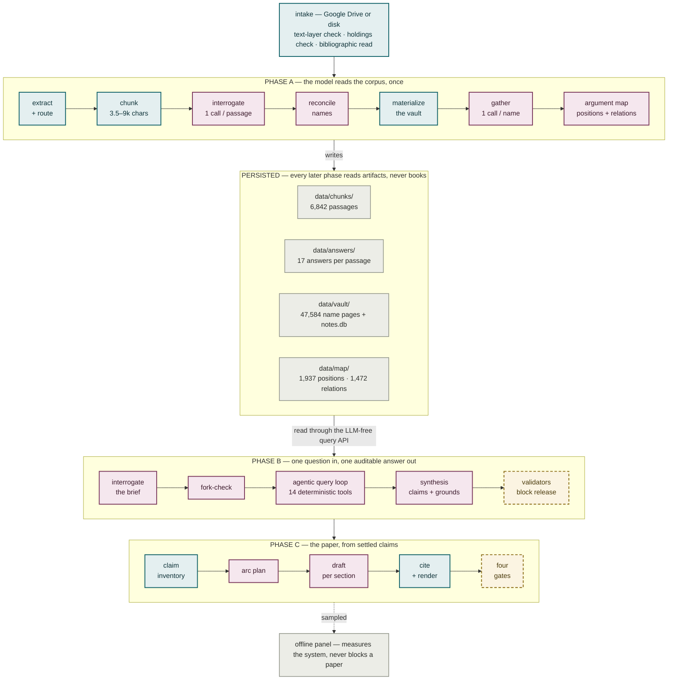
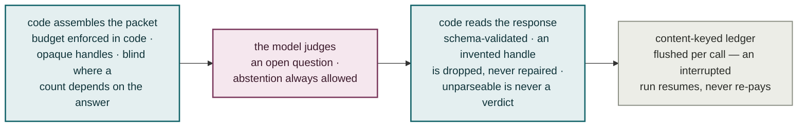
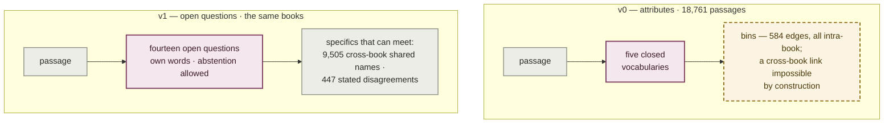
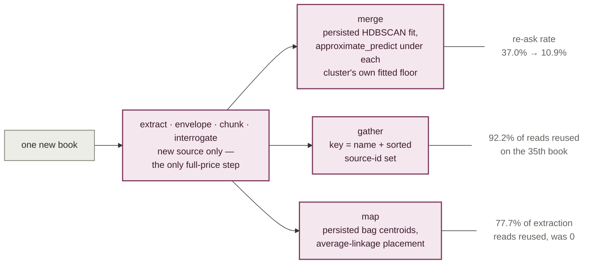
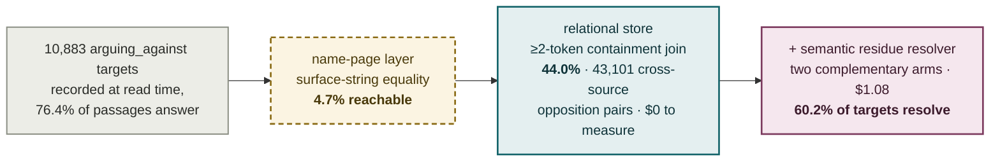
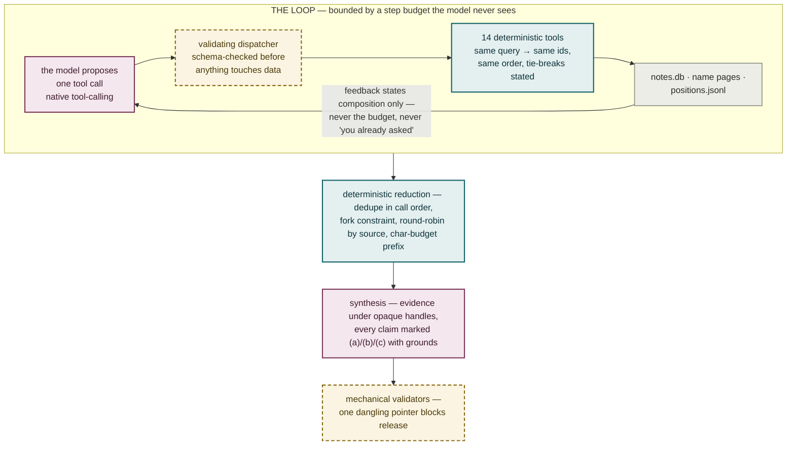
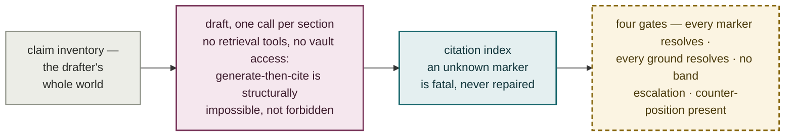
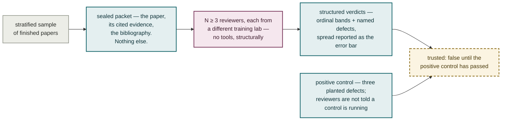
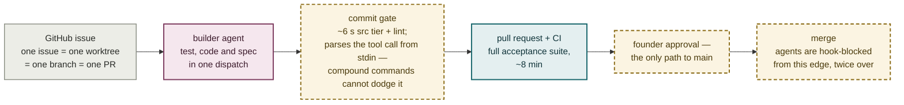

# Axial — the engineering report

**Building a production instance of the LLM-wiki pattern, and what it took to make the numbers honest**

Version 1.0 · 6 August 2026 · Muhanad Abulhusn

*This is the technical companion to [Axial — a research report](axial-report.md). That document explains what the system does and what the evaluation showed, for readers who do not build software. This one is for engineers. It covers the architecture, the measurement discipline that shaped it, the caching and incremental-computation design, the evaluation machinery, and the one-operator agentic process that built all of it in 31 days. Nothing here is repeated from the other report except where a number needs its context restated.*

---

## Abstract

Axial reads a shelf of academic books once, passage by passage, and materialises the reading as an Obsidian wiki, an argument graph, and, on demand, a research paper whose every citation is machine-checkable back to a passage. The pattern is the one Andrej Karpathy sketched in his April 2026 "LLM Wiki" idea file: compile sources into a persistent, interlinked knowledge base once, then query the compilation instead of the raw text. Axial is what that sketch looks like after a production hardening pass: 57,000 lines of Python surrounded by 93,000 lines of tests, a deterministic core with model calls confined to sixteen audited seams, content-keyed decision logs that make every paid model call resumable and every re-run free, and an evaluation stack that assumes large-language-model judges are generous liars until a planted-defect control proves otherwise.

The engineering results worth the reader's time: a closed-vocabulary tagging layer was retired after measurement showed a 0.73 intra-annotator ceiling that no prompt, model, or context change could move, and its replacement (open interrogation) produced the cross-book structure tagging structurally could not; retrieval was rediagnosed from a ranking problem to a join problem, lifting resolvable opposition links from 4.7% to 60.2% of targets; incremental corpus growth was taken from 93% wasted spend to 92% reuse by keying caches on what actually changes an answer; and a nine-model evaluation panel is trusted only because it caught three planted defects unanimously before any of its clean verdicts were reported. Full-corpus ingestion costs about $34, the argument map $0.75, and a finished paper $0.12–0.16. The entire system was designed, built, measured, and documented by one person orchestrating AI agents under deterministic gates, between 6 July and 6 August 2026.

---

## Contents

- [1. The pattern, and the delta](#1-the-pattern-and-the-delta)
- [2. System overview](#2-system-overview)
- [3. The design rule everything else follows from](#3-the-design-rule-everything-else-follows-from)
- [4. Measure first: how tagging died](#4-measure-first-how-tagging-died)
- [5. Idempotency and incremental computation](#5-idempotency-and-incremental-computation)
- [6. Retrieval is a join problem](#6-retrieval-is-a-join-problem)
- [7. The argument map](#7-the-argument-map)
- [8. Knowing what a model call is worth](#8-knowing-what-a-model-call-is-worth)
- [9. Evaluation without ground truth](#9-evaluation-without-ground-truth)
- [10. Operational engineering](#10-operational-engineering)
- [11. How it was built](#11-how-it-was-built)
- [12. Related work](#12-related-work)
- [13. Limitations](#13-limitations)
- [14. Conclusion](#14-conclusion)

---

## 1. The pattern, and the delta

In April 2026 Andrej Karpathy published a gist he called an "idea file": instead of running retrieval-augmented generation against raw documents forever, have an LLM agent compile the documents once into a persistent, structured, interlinked markdown wiki, and direct every later question at the wiki. Add a source, and the agent integrates it: updating pages, noting contradictions with existing claims, minting concept pages. The knowledge compounds instead of being re-derived per query.

Axial began from that idea plus one observation about Obsidian: a markdown vault whose pages link each other is already a graph database with a free renderer. What the idea file does not address, because idea files do not have to, is everything that makes such a system trustworthy at production scale:

- What question do you ask each passage, and how do you know the answers are more than noise?
- What happens when the same model gives a different answer to the identical input, which it measurably does 9–36% of the time depending on the task?
- How do you add book 35 without re-paying for books 1–34?
- How do you evaluate output for which no answer key exists or can exist?
- How do you stop the model that writes the final paper from inventing a citation?

Axial's contribution is a worked, measured answer to each. The system is domain-general in mechanism and Syria-specific only in content: the domain frame is data loaded at runtime, and no country-specific logic exists in `src/`. The current corpus is 35 scholarly works on state formation, nationalism, and political violence, read into 6,842 passages, 47,584 name pages, and an argument map of 1,937 positions joined by 1,472 stated relations.

---

## 2. System overview

### 2.1 Pipeline

Three phases are built and running end to end; one command takes a research brief to a rendered paper. In every diagram in this report, teal is deterministic code, mulberry is a model call, dashed brass is a gate, and grey is a persisted artifact — the same visual grammar the repository's own architecture plates use.

**Phase A — ingestion.** Intake (bibliographic recovery from the file itself, never the filename) → extraction to a structural tree (docling, cached, reused by every later stage) → a one-call-per-book *envelope* capturing the book's stated thesis, scope, and argument → deterministic chunking into 3,500–9,000-character passages along the author's own boundaries → *interrogation*: one model call per passage answering fourteen open questions (claim, argumentative move, whose position, who it argues against, who it cites and how, every named thing, mechanism, evidence, concessions, assumptions) → *reconciliation* of name variants (string fold, then clustering as a viewing aid, then a model deciding each merge with "cannot tell" as a first-class outcome) → *materialisation* of the vault (zero model calls) → *Gather*: per name, one question — what do these authors disagree about?

**Phase A′ — the argument map.** Select every passage that argues something (6,010 of 6,842 at the current corpus) → *bag* by similarity of their one-sentence claims using a local sentence encoder, zero model calls → *extract* recurring arguments from each bag, blind to authorship → *merge* near-duplicate namings → ask every position how it stands to its neighbours, with no menu of relation types. The model coined 504 relation labels on this corpus; 328 relations join positions with no author in common.

**Phase B — analysis.** A brief is interrogated before it is answered (coverage, smuggled premises, refusal as a completed run) → an agentic retrieval loop proposes one query at a time against 14 deterministic tools over a relational store; every proposed call is schema-validated before it touches data → evidence is assembled deterministically, round-robin across sources → synthesis returns numbered claims, each marked **(a)** source-says, **(b)** inferred-across-sources, or **(c)** analyst judgment, each with resolvable grounds → mechanical validators block release on any dangling pointer.

**Phase C — the paper.** Claim inventory → narrative plan → one drafting call per section → deterministic citation indexing → render. The drafter has no retrieval tools and no vault access: the claim inventory is its entire world, so generate-then-cite is structurally impossible rather than forbidden by instruction.

### 2.2 Stack

| Dimension | Choice |
|---|---|
| Language / runtime | Python 3.13, `uv`, hatchling |
| CLI | `argparse`, 29 commands, role-gated (operator vs analyst) |
| LLM access | OpenRouter over `httpx`; a 4-implementation `LLMClient` protocol (real, stub, recording, and a poison client that proves cache hits by raising on any call) |
| Embeddings | `sentence-transformers/all-MiniLM-L6-v2`, local, CPU; PCA (93 components) + HDBSCAN for names; agglomerative clustering for the map |
| Stores | JSONL artifacts on disk; one SQLite file (`notes.db`, 7 tables, ~54 MB) opened read-only per query; LanceDB for name vectors; markdown vault as the human-facing view |
| Tests | pytest + xdist; 3,498 collected tests; unit tests co-located under `src/`, acceptance contracts under `tests/` |
| CI | GitHub Actions; the full suite is CI-only (~8 min); the local commit gate runs the `src` tier in ~6 s |
| Concurrency | `ThreadPoolExecutor` only — no async, no broker, no queue service |
| Platform | Windows 11, one machine |

There is no framework, no ORM, no dependency-injection container, and no vector database in the retrieval loop. Every heavy dependency is imported lazily behind an injectable seam, so the unit suite runs without any of them.

### 2.3 Scale of the build

57,654 lines of production Python, 93,175 lines of tests (the test-to-code ratio is 1.6:1), 223 test files. Docstrings carry the measurement that justified each constant — the codebase doubles as its own lab notebook, and this report is largely assembled from what the code and the decision log already say.

---

## 3. The design rule everything else follows from

The architecture document states it in four sentences:

> Every model call in this system is surrounded the same way. Code assembles what the model sees, so a packet cannot overflow and a prompt cannot be talked into fetching more. Code reads what comes back, so an invented handle is dropped rather than repaired and a batch nothing could be parsed from is never recorded as a verdict. And code holds a ledger beside every paid pass, so an interrupted run resumes instead of paying twice.
>
> **The model does the judgment. The code holds the line.**

The anatomy of one paid call, anywhere in the system:

Concrete consequences, each of which exists because the softer alternative failed on a real run:

**Budgets are code, not prompts.** "A prompt-side budget is a request; a code-side budget is a guarantee." Gather's packet budget is two constants — a per-member cap and a whole-block cap — because only the pair makes the guarantee arithmetic at any corpus size. The cap moved 400 → 800 characters the day measurement showed whole-line truncation was deleting the `arguing_against` field from 22.4% of rendered packets.

**Invented references are dropped, never repaired.** When a long-context run blended two similar 200-character chunk ids into one that pointed at the wrong scholar's work, the fix was not fuzzy matching. Synthesis now sees evidence only under opaque short handles (`[c3]`) resolved back by exact lookup; there is no long id in the prompt to transcribe. A proposed component-matching repair was explicitly rejected because it "would resolve the citation uniquely and silently manufacture a claim whose prose credits one scholar and whose evidence is another's."

**Abstention is a first-class answer.** Every interrogation field is three-state: an answer, an explicit `not-in-passage`, or absent (the call failed). "A guessed answer is worse than an abstention, because nothing downstream can tell it from a read one." Separately, `[]` is an answer, not a blank: 19.3% of passages answer `arguing_against` with an explicit empty list, a real reading ("names no opponent") that must never be collapsed onto the abstention.

**Feedback to an agent is composition, never budget.** The retrieval loop's per-turn feedback states what the evidence set holds and which books it spans — never the step budget, never the cap, and never "you already asked that." The last one was measured: telling the model it had repeated a query *raised* the repeat rate from 14% to 20%. A cap a model can see is a cap it argues with.

**Where a count depends on the answer, the question is asked blind.** The models that group arguments and relate them never see authorship, because a model shown authors decides what should meet, and the cross-author statistics would then measure their own input.

**Failure states are structural, never sentinel.** A gate metric with an empty denominator reports `not-scoreable`, distinct from pass and fail, because "a metric that vacuously passes on zero observations reads as a green light for a check that never ran." Abstention on a voted axis is a flag beside the value space, not a value in it, because it asserts something about the draw distribution, not about the passage.

---

## 4. Measure first: how tagging died

Axial v0 did what most document-intelligence products do: tag every passage against five closed vocabularies and query the attributes. The full account of why that failed is in the companion report; what belongs here is the measurement sequence, because the method is reusable and each step killed a hypothesis the previous step left standing.

1. **Measure agreement before trusting labels.** Two frontier models from different labs, same instructions, same 120 passages: 0.49 agreement on the two judgment-heavy axes, against a 0.60 survival bar.
2. **Exonerate the model.** The cheap production tagger agreed with one frontier labeller *more* (0.56) than the two frontier labellers agreed with each other (0.49). Capability was never the lever.
3. **Price the prompt interventions, and accept the nulls.** A codebook rewrite costing +55% tokens per call moved agreement ~0. An explicit unit-of-analysis rule: +0.02. Feeding the book's own thesis into the labelling context: −0.01. All three shipped nothing; the codebook was trimmed back and kept for readability alone, explicitly not for a measured gain.
4. **Find the ceiling.** The same model, identical prompt, run twice, reproduced its own `theory_school` label 0.73 of the time. Two independent coders also agreed 0.73. Inter-annotator agreement cannot exceed intra-annotator reliability, so there was no headroom: the variance was in the question.
5. **Break the ceiling to prove the diagnosis.** If a single draw samples around a modal answer, majority voting should recover the mode. Predicted from the 0.88 single-draw modal hit rate: ~0.92 at best-of-3. Measured: 0.918. The intervention matched the diagnosis, which is why it worked while three prompt-side interventions did nothing — and its honest cost was an 8.8% abstention rate on genuinely contested passages.
6. **Then notice reliability was never the real problem.** At the end of v0, 18,761 tagged passages had produced 584 connections, every one inside a single book. The only edge-minting mechanism asked a closed question and filtered against that book's own figure list, so its output was bipartite and intra-source *by construction*. No parameter could have produced a cross-book link. "An attribute sorts notes into bins. It cannot express a relation, so it cannot be an edge."

The retired vocabularies survive as prompt examples behind a triple guard (free answer first, nearest-example as a separate marked field, and no code path that bridges the two), with a collapse metric watching for the silent failure mode in which interrogation quietly rebuilds tagging.

The general lesson, applied twice more later at retrieval and at the relation pass: when a closed instrument underperforms, measure whether the *question* admits one answer before spending anything on the detector.

---

## 5. Idempotency and incremental computation

This is the deepest engineering investment in the system, and it exists because model calls are the only expensive thing in it. Everything deterministic re-runs for free; the design problem is making sure nothing paid is ever paid twice, and that adding a book costs what the book costs.

### 5.1 Three caches, keyed differently on purpose

Every paid pass writes a content-keyed decision log, but the *key* differs by what would change the answer:

| Pass | Key | Why this key |
|---|---|---|
| Name merge | sha256 of the batch's **rendered member list** | The evidence shown to the model is the decision's input; a provenance change is a different question |
| Gather | the name + its **sorted source-id set** | "A disagreement is a property of who is in the room": a 200-note page gaining its 201st note from an author already present cannot change who is arguing with whom. Measured before the change: 55% of one run's re-asks contained no note from any new book |
| Argument map | sha256 of the **raw source content** only | A rebuild should fire when the corpus changes and must not fire when the prompt, model, or reasoning tier changes; `--force` is the deliberate, priced escape hatch, and it shelves the old ledger rather than deleting it |

The key-design discipline cuts both ways, and the sharpest incident in the log is a *correctness fix that was also a spend hazard*. Re-keying merge batches on rendered text (correct) meant the first run after attaching provenance evidence would see all 21,050 recorded decisions as undecided and silently re-ask the whole corpus as a side effect of a flag. The guard exploits the fact that every record still carries its bare, tier-independent membership: the pass detects batches pending *only because the key schema changed* and refuses to spend, raising an error that names the exact count before any client is constructed, until the operator confirms with `--confirm-reask`.

A companion hazard is documented as a standing rule: `source_id` is filename-stem + content-hash, so **renaming a file is a re-ingest**, and every artifact keyed on it goes stale with the content hash giving no warning. When it happened, the eval cases were remapped by hash and the old corpus pin was retained unmodified, because "rewriting its ids would describe a corpus that never existed."

### 5.2 The 93% problem, and its fix

The first time books were added to a finished corpus (3 into 31), the run cost $10.26 and 9.5 hours — and of its 8,971 model calls, **93% were spent re-processing the 31 books already ingested**. Three causes, three fixes, each validated on the real corpus. The end state, for one new book:

**Merge re-clustered globally.** A fresh HDBSCAN fit reshuffles cluster membership, disturbing 37% of merge batches for a 3-book delta. Fix: persist the fitted transform chain and the clusterer (joblib), place new surfaces via `approximate_predict`, and accept a prediction only if its membership strength clears *that cluster's own fitted floor* — the minimum probability HDBSCAN gave its own training members, derived from the fit rather than hand-tuned. The floor matters: genuine members predict at median strength 0.80, but 19 of 20 points of a genuinely new cluster were being swallowed into an unrelated existing cluster at median 0.29. Failures fall to a residue clustered fresh with labels offset above the existing maximum; existing labels are never renumbered. Result: re-ask rate 37.0% → 10.9%.

**The map re-bagged everything.** Agglomerative clustering has no `approximate_predict`, so one was built: persist each bag's centroid as an unnormalised mean and place new passages by nearest centroid under average linkage. The obvious alternative (cosine to the normalised centroid) was measured swallowing 96.8% of a real 535-passage delta into 3 residue bags, where average linkage swallows 78.1% into 22 — and the cheapest tell that the first version was broken was simply comparing bag counts against a fresh fit (608 vs 647 broken; 645 vs 647 fixed). Result: 77.7% of extraction reads reused where the old path reused zero.

**Gather re-rendered any page that gained a member.** Fixed by the source-set key above.

The end state, measured on the 35th book: Gather asked 144 reads and reused 1,704 (92.2% reuse), with 132 of the 144 genuinely touching the new book. A map rebuild whose pin did not move costs $0 and 157 seconds. And the reuse is observable by contract, not by faith: four counters (`units_total`, `units_reused`, `units_asked`, `units_asked_touching_new`) are reported identically by every incremental pass, with the invariant that a second run over an unchanged corpus reports `units_asked: 0`. The counters were validated corpus-wide for free by running with `limit=0` and a client that raises on any use.

One honest caveat rode along: the agreement of an incremental fit with a from-scratch re-fit is only 0.83, and an early reading treated that as catastrophic. The correction became a memory-grade rule: agreement with a re-fit is not a quality measure. Measured on what the clusters are *for*, the grown bags' coherence was 0.776 against the fresh fit's 0.793, and `--recluster` exists as a periodic corrective.

### 5.3 Resume everywhere

Below the decision logs sit three plainer layers. A per-source TSV ledger with per-pass done-predicates (with artifacts-on-disk beating the ledger where they disagree, because the ledger once reported a fully-ingested corpus as 31 sources of new work). JSONL checkpoints whose append path flushes per record, so a hard kill can tear only the in-flight line, and the healer drops exactly that line and raises on anything torn elsewhere. And run directories under `data/logs/` with a heartbeat, structured events, and a report written on every exit path.

The proof these layers work arrived unplanned: a residue calibration run was killed by an external timeout at call 137 of 200, and the relaunch re-asked zero of the 137 already-decided pairs.

---

## 6. Retrieval is a join problem

Phase B's retrieval layer was rebuilt once, and the rebuild is the cleanest diagnosis-driven redesign in the project.

### 6.1 The diagnosis

Interrogation had produced a typed graph: `arguing_against` is answered on 76.4% of passages. Materialisation then kept only the node labels, grouping passages into name pages by surface string. Measured offline over the live corpus, only **4.7%** of the 10,883 opposition targets joined to anything a query could reach. Every retrieval patch to that point — tier stops, IDF ranking, string folds, numeric weights — had been tuning a lossy projection of data the system already had.

Loading the same records into seven SQLite tables lifted the conservative join (≥2-token match, because single-token canonicals like `Rule` and `His` push the permissive rate to a noise-poisoned 93.4%) to **44.0%**, exposing 43,101 high-confidence cross-source opposition pairs across 343 named scholars and works. The measurement cost $0: it was SQL over records already on disk. The name layer survives as a filter and a rendered view; `find_names` reproduces as one GROUP BY, verified byte-identical against production output.

The remaining 56% of targets are prose position descriptions ("the modernist view of nations") with nothing to key a join on. A semantic resolver closes part of that gap: sample-calibrated on 100 targets ($0.019), then run in full over 5,846 targets for $1.08, resolving 25.9% — within 1.1 points of what the 1/58-scale sample predicted. Two candidate-selection arms (section-blocked and embedding top-20) were both kept because measurement showed they are near-complementary, not nested: dropping the blocked arm would have cost 500 edges to save $0.30. Combined coverage: **60.2%** of opposition targets now resolve.

### 6.2 Two instrument bugs worth confessing

Both were found by reading records already on disk, with zero paid re-runs, and both had manufactured the project's then-loudest finding.

**The oracle preferred commentary.** The required-source oracle scored "did the run cite the right books" by counting which source carries the most notes on a question's anchors. On any theorist's page, the commentary volume about them wins: `hall-2006` holds 175 of 379 notes on Michael Mann; Mann's own volume holds 3. One case therefore *required* the commentary and no Mann volume at all — and the one entry that didn't follow the rule turned out to be a silent hand override. The oracle now scores per-demand legs, and a demand anchored on an author names that author's own books, never the books that cite them.

**`get_name` returned an alphabetical prefix.** Page members were grouped by source id alphabetically and truncated at `limit` — so Tilly's own book began at member 108 of his page, unreachable at any limit the loop used, and `hall-2006` led every window because *h* sorts early. The fix is round-robin across sources. Fixing both took the hardest brief from 3 of 8 demanded legs to 7 of 8 at the same budget, with commentary share falling from 37.5% to 11.1% against a 5.53% corpus baseline.

### 6.3 What the loop is, and what it is told

The tools cover notes, opposition pairs, name pages, co-occurrence, citations, argument-map positions, envelopes, and raw chunks; a malformed call is recorded as a trajectory entry with an empty result and consumes a step. A capped result always reports its true total. And one read-only counting tool is deliberately *not* registered to the model, because on the one run where it was, the model called it, the prompt jumped to 1.2 million characters, and the run billed 4.9 million prompt tokens.

Two findings bound the loop's budget economics. Raising the step budget from 14 to 20 across four paid runs never changed what reached the model: composed evidence sat at 17–21 notes while gathered evidence ranged 56–181, so the synthesis prefix, not the search wall, is the binding constraint. And separately, tripling the evidence-character budget tripled cost while the oracle went *down* — more evidence in front of the writing model is not more evidence in the answer.

An optional second arm replaces the loop entirely: decompose the brief into stated arguments (before seeing the corpus, so the shelf cannot bend the question), land them on the argument map by cosine, and walk every relation touching a landed position in both directions. The account the answer must reject arrives because it argues with what landed, not because the brief happened to name it. Judged blind against the loop on the same brief: strong grounding versus adequate, half the defects, on 4 sources cited rather than 8 — which is also why "sources cited" is never read as a quality score here.

---

## 7. The argument map

The map is the layer that makes Axial more than an index, so its build rules are worth stating precisely.

```mermaid
flowchart LR
    ans["data/answers/"] --> sel["select<br/>argues something<br/>6,010 of 6,842"] --> bag["bag by claim similarity<br/>local encoder,<br/>zero model calls"] --> ext["extract recurring arguments<br/>blind — bare handles,<br/>never an author"] --> mrg["merge near-duplicate<br/>namings"] --> pos["1,937 positions"]
    pos --> nb["neighbourhoods<br/>8–12, never all-pairs"] --> rel["relate<br/>no menu of<br/>relation types"] --> out["1,472 relations<br/>504 coined labels ·<br/>invented handles dropped"]

    classDef code fill:#E4EFF0,stroke:#14646A,stroke-width:2px,color:#0F3339;
    classDef model fill:#F5E7EE,stroke:#7C3A5E,stroke-width:2px,color:#3C1B2C;
    classDef store fill:#ECEDE7,stroke:#8B8F84,stroke-width:1.5px,color:#2A2C28;
    class sel,bag,mrg,nb code;
    class ext,rel model;
    class ans,pos,out store;
```

Four rules are load-bearing:

**Blind extraction.** Bags of similarly-claiming passages are read in full (never sampled) under bare handles: `[p7] <claim>`, no author, no book, no year. Authorship visible during extraction would let the model decide what meets, making the cross-author counts measure their own input. The model is also told explicitly that returning roughly one argument per passage is a failed read.

**No menu of relations.** The relation pass asks how two positions stand to each other in the model's own words. This was measured, not assumed: told nothing, the model volunteered opposition on only 6.6% of pairs, which is exactly why an engine *told* to find opposition cannot be trusted when it finds it. "Unrelated" is kept cheap to say. The 504 coined labels were categorised afterwards from what came back.

**Neighbourhoods, never all-pairs.** A flat clustering once produced a 53-position group — 1,378 pairs in one call, which no model can weigh. Positions are related within recursively-split neighbourhoods of 8–12.

**The grain is a stated choice, not a fitted one.** The same corpus yields 1,636 positions at a tight clustering threshold and 234 at a loose one. No correct number hides in the data, so the threshold is declared, documented, and owned, rather than swept until a metric looks right.

Cost: $0.75 and 45 minutes for the initial 31-source build at 20 workers; $6.05 for a full rebuild after the corpus grew; $0 for a rebuild whose pin did not move. Scaling measured across corpus sizes: passage-to-position count grows roughly linearly (k = 1.04), but the graph densifies — cross-book relations rose from 8.7% to 38.4% of the total and have not plateaued, which is the empirical warning that selection, not extraction, becomes the problem near 100 sources.

---

## 8. Knowing what a model call is worth

The project treats model behaviour the way an experimental science treats an instrument: characterise the noise before reading the signal, and price every intervention against measurement.

### 8.1 Noise floors first

The standing method: before comparing any two configurations of a model pass, re-run the *same* configuration on identical input and measure self-agreement. Three passes have measured floors:

| Pass | Self-disagreement on byte-identical input | Consequence |
|---|---|---|
| Name merge (all batches) | 9.3% | An 85.5% "drift" from a candidate optimisation was within noise; the honest rejection reason became "it is 1.9× slower" |
| Name merge (3+ members) | 18.8% | A whole class of A/B comparisons on this pass declared unreadable at feasible sample sizes |
| Gather | 19.3% overall; 36.1% of recorded disagreements return null on re-ask | A Gather finding is demoted to a retrieval hint, never a citation; no gate scores against one |

Two follow-ups made the merge floor useful rather than alarming. Temperature was ruled out as the cause (14.7% at T=0 vs 13.3% at T=1 — greedy decoding was also slower, more verbose, and *still* non-deterministic). And the instability was measured against what it touches rather than what it flips: 19.3% of batches flip, but only 0.43% of underlying passages change page, every observed flip being a singular/plural or article variant. The 5% acceptance bar was set by the founder before the run; the result came in 3.5× under it; the issue closed with the instability accepted and a written re-open condition.

One measurement in this family produced a genuine positive: on 2-member batches, where the pass agrees with itself 97.7% of the time, adding source provenance to the prompt changed decisions at 9.3% — a 7-point lift over the control (z = 2.18, p ≈ 0.03), which is how the provenance evidence earned its permanent place in the cache key.

The run-level analogue of the noise floor is the standing n=1 rule: one brief has been measured moving 39% between two runs of identical code, so a single draw of a single question is not a measurement, and an apparent regression is re-drawn before it is believed. The first application retired a "regression" that scored its best result ever on the second draw.

### 8.2 Concurrency, measured not assumed

Effective concurrency is computed for every long pass as summed model-call latency divided by wall clock — never read off the worker count. The measurement caught interrogation running strictly serially (effective concurrency 1.00) inside a run whose other passes ran at 16.7–33.9, hidden in 9.5 hours of wall clock that packed 94 hours of API latency. The fix took interrogate to 12 workers.

The counter-example is as instructive: merge stays at 36 workers although 128 was tried, because 128 bought 1.28× throughput for 2.8× the parse failures — a concurrency/quality trade measured once and pinned as config. Two structural facts govern the ceiling: providers saturate (96 workers gave ~25% more throughput than 36 for 2.7× the workers, with error rates rising toward 1%), and Gather's workers are per-name, so hub pages serialise — `Syria` held one of 48 slots for 38 minutes, and the hubs, not the volume, set the wall clock.

Latency itself is output-bound. Per output token the "slow" and "fast" models here are close (19 vs 10.5 ms on drafting; the slow one is *faster* per token on synthesis); the 5.6× wall-clock gap between them is verbosity. The practical corollaries: a one-question re-ask is ~5× faster than a full interrogation, a cost estimate that ignores completion tokens will be wrong by 4× (a Gather pass long quoted at $1.25 measured $4.94, with completion tokens running equal to prompt), and a $16 estimate for a backfill came in at $1.96 because the real pass averaged 60 completion tokens per call.

### 8.3 Model tiering by trial

Model, reasoning effort, temperature, and vote count are all per-pass configuration resolved through symbolic tiers, never hardcoded at call sites; an unresolvable tier raises loudly when the pass is called and never falls back silently to a cheaper model. The tier assignments are individually earned:

**Open-weight vs proprietary, whole wirings.** Two sealed processes, same corpus pin, same code, config-isolated from each other; six blind reviewers, arm order flipped between questions. The open arm (deepseek/glm) won the case question 3–0; the proprietary arm (gpt-5.4/5.6-sol) won the survey question 3–0; the open arm cost 3.5× less ($0.618 vs $2.167). The proprietary arm's failure mode is worth naming: it composed five passages, reached no Syrian evidence at all, and answered a question about Syrian paramilitaries with a Colombian example from a footnote — rated strong on grounding and weak on completeness by every judge. Rigour about material that does not answer the question is a real and measurable failure class.

**Per-pass swaps, judged blind.** A cheaper model (gpt-5.6-luna) was trialled against incumbents pass by pass, three judges from three labs, assignment flipped per unit, identical evidence objects handed to both arms. It won synthesis (7–2, 6.1× cheaper) and envelopes (8–1, 1.6× cheaper, 3.6× faster), lost counter-position (5–1, plus a schema hard-failure), and *lost Gather while costing 2.1× more* — because it writes twice the output tokens against an incumbent that prices output at a tenth, and because judges found it manufactures disagreements, which poisons the page it writes. The portable finding: **a model is only cheap against expensive models**; per-token price means nothing until multiplied by measured verbosity on the actual task.

**The reverted switch.** The envelope pass was moved to a new model on a 5-source A/B, then reverted when the full-corpus regeneration produced 6 degenerate outputs where the incumbent's run had 0 — the A/B had sampled the sources the challenger handled well, and one source going clean-run/garbage-run under the same model proved the variable was the roll, not the model. The decision was deferred behind a model-independent robustness fix so that a future comparison measures quality rather than single-shot variance.

---

## 9. Evaluation without ground truth

There is no gold standard for "the right synthesis of 35 books," so the system never claims correctness. It claims **auditability** — "correctness is unknowable at the frontier of a synthesis; accountability to grounds is always checkable" — and the evaluation stack is built so that every trustworthy-looking number has had to earn the trust structurally.

### 9.1 Gates: mechanical where mechanically checkable

Four per-paper gates run on every draft. Two are mechanical and hard: every citation marker resolves through a claim to a passage (one dangling marker fails; n=215 markers at 1.0000 on the current papers), and no confidence band was ever raised across a layer boundary (carried claims copy their origin's *clamped* band — 77% of claims in one sweep had been clamped below what the writing model asserted, which is exactly the inflation the copy rule blocks). Two are narrow judged checks (does any cited passage contradict a new cross-source inference; is an inference dressed as a source's words), each run by a model that a guard verifies is not the model that wrote the paper, the guard raising before any call is made.

Three details separate this from checkbox testing. Thresholds live in config keyed by metric name, and Phase C deliberately mints new metric names rather than reusing Phase B's, because two thresholds behind one name would let whichever gate resolved second silently win. Metrics with nothing to measure report `not-scoreable`, which blocks, rather than a vacuous pass. And one designed gate was rejected *for reading 0.0000 too reliably*: it scored zero on the very record containing the planted contradiction it was built to catch, and "a gate that reads 0.0000 whatever the drafter does is worse than no gate: it looks like evidence."

Several obvious metrics (source concentration, cross-source inference rate, commentary share) are computed on every run and deliberately not gates, under a standing promotion rule: inspect the distribution, find the cut that separates good from bad as judged by a reader, then set it — never before. The same discipline retired an asserted-but-never-firing threshold on reviewer disagreement.

### 9.2 The panel: adversarial trust

Its integrity properties are enforced by construction:

- **Sealed by tooling, not instruction.** A reviewer receives the rendered paper, the resolved text of every cited passage, and the bibliography — nothing else. The dispatch path has no parameter through which tools could be passed, which is stronger than any harness check that could be forgotten: "an agent holding file tools will read the repo whatever the prompt tells it. Isolation you ask for is not isolation."
- **Different training lab, not different model id.** Vendor means the lab that trained the model, never the API provider; a sibling model finds the same arguments persuasive for the same reasons. A model absent from the in-code lab table is a hard error, never assumed distinct.
- **N ≥ 3, spread reported.** Three reviewers splitting 1/3/5 and three agreeing on 3 must never render identically.
- **No number until the control passes.** LLM judges are systematically generous and moved by confident prose, so the panel reports nothing until it has caught planted defects it was not told about: a fabricated claim cited to an irrelevant passage, a counter-position replaced with a caricature, a high band over disclosed-thin coverage. The control has failed once in the project's history — a cheap-tier, single-vendor panel caught 0 of 3 — and every number from that panel was discarded. The current panel caught 3 of 3, unanimously, across three reviewers.

The instrument then did what only a reader can: five of six reviewers independently flagged a citation that resolves cleanly to a real passage which happens to be a publisher's catalogue page, and four independently diagnosed that the papers' keystone Syrian claim is carried by Moroccan and Egyptian evidence — a corpus gap presenting as a citation defect, which no retrieval work can fix and which the library-coverage measurement is designed to name. The mechanical oracle and the blind readers also converged once on the same missing source from opposite directions, the first cross-validation of the two instruments.

Two reporting rules bind everything above. Every panel figure travels with its frame (papers, tiers, wirings, pin, reviewer count, labs, spread) — "a number quoted without its frame is not a weaker claim; it is a different and unsupported claim." And no figure may ever be reported as measured against human expert judgment, because no human expert is in the loop; the specification forbids the relabelling in writing.

### 9.3 Questions that cannot flatter the system

The test briefs are machine-authored by a model with no repository access, working from the measured index alone, forbidden to name books. Two design rules keep them honest: a question must not name the finding it probes (the thin-coverage brief never mentions thinness — noticing unprompted is the test), and nothing simulated is ever an answer key: a pre-written "expected answer" was retired as a referee and is barred from reviewer packets because showing a judge a reference answer anchors the judge. The adversarial set inverts this once, deliberately: each brief carries a smuggled premise stated in a block that is stripped before the brief reaches the engine, and the gate scores whether the pre-pass caught it.

---

## 10. Operational engineering

A one-machine, real-money pipeline generates its own class of engineering, and the project logs it with the same rigour as the product.

**The founding postmortem.** The first full ingestion (July 2026) landed 1 of 22 sources on the first attempt and spent 69% of 182 logged compute-hours on failed attempts, because a per-chunk error was source-fatal, the worker loop re-ran completed sources (26 attempts, 14.7 hours, zero new notes), and the suite had been validated against the smallest, cleanest input in the corpus. Every resume mechanism in section 5, the failure-class taxonomy in the LLM layer, and the standing anti-softball rule ("gates are scored on inputs the system cannot already ace") descend from that document.

**Detach, journal, checkpoint.** Three paid runs were lost to the environment killing a foreground process before the rule was written: long runs launch detached (`Start-Process`), journal every event to an fsynced JSONL before the next line executes, and checkpoint whatever is already bought. A stubbed zero-cost smoke pass over the harness caught two harness bugs before the next paid run. Corollaries that now hold everywhere: a baseline is snapshotted before any re-ask that could overwrite it, and destructive-by-default file opens are treated as the bug class they are (one run's `open("w")` truncated its own journal).

**Done-predicates are load-bearing.** A pass that skips on a ledger nobody wrote will happily re-run a finished corpus; measured on one source before the fix, a "free" re-chunk was byte-identical but cost seven model calls, and byte-identity is not guaranteed — one chunk landing differently would renumber the source's ids and orphan every analysis pinned to them. Skip logic now keys on the pass's own persisted artifact wherever one exists.

**Windows specifics.** `os.replace` fails outright when any reader holds the destination without `FILE_SHARE_DELETE`, where POSIX would swap silently — so an atomic-write design that protects readers still needs a writer-side retry, and the two are separate problems. MAX_PATH produced real `FileNotFoundError`s from long academic section titles twice (vault filenames, then chunk-record paths). Orphaned children of killed shells kept spending against stale prompts until a PID guard made second starts refuse.

**Watch your watchers.** A 49,674-file vault scan stalled a run for 9m22s until an index cut it to 0.61s, and the diagnostic habit that found it is recorded with it (`py-spy dump` on any quiet run). A watch whose success pattern never fires is indistinguishable from a job still running; every watch now has a quiet-detector. And a worker count copied from an old log launched a run *below* its own default — concurrency settings are read from config, never from memory of previous runs.

**Read code before spending.** The Google Drive connector's live debut ingested 34 books with zero model calls and zero duplicates, but only because a pre-run code reading found the cache was keyed on Drive file ids while `source_id` embeds the filename — a mismatch that would have re-ingested the entire corpus (~$35–45) and doubled every name page. The cheaper prevention was also chosen over the cheaper-looking one: rather than renaming 34 files in Drive by hand, the folder was re-uploaded from disk, making the bytes identical by construction instead of leaving identity to chance.

---

## 11. How it was built

The build process is itself an engineering artifact, and for some readers the more transferable one. Axial was built by one person operating a Claude Code session as an orchestrator, dispatching builder agents under deterministic gates, between 6 July and 6 August 2026. In those 31 days the tracker's shared issue-and-PR numbering reached #714, the decision log reached 67 entries, 26 instrumented run logs were written, and the ~150,000 lines of code and tests described above were built.

The governing structure is small:

**Two rules.** Nothing merges without the founder's word — agents are hook-blocked from merging entirely, and the founder's approval is the only path to `main`. And specs are living documentation: whoever changes behaviour updates the spec in the same PR, so code and contract are reviewed together, and "spec drift" is a diff to review rather than a process to adjudicate.

**Deterministic gates, adversarially tested.** The commit gate runs the fast test tier (~6 s) plus lint on every commit and blocks red commits and code commits to `main`. The merge gate blocks agents from `git merge`, `gh pr merge`, and pushes to `main`. Both gates are scripts that parse the tool call from stdin rather than pattern-matching command strings, because `if`-style filters are dodgeable by compound commands (`git add && git merge`); the gate scripts carry their own 43-case exit-code test suite covering compound commands, path traversal, and Write-vs-Edit equivalences. Both are double-wired (agent-scoped and global) after one live dispatch was observed running on a stale agent snapshot with dead guards. When a gate fires, the standing rule is: fix the cause, never the hook.

**Isolation by worktree.** Every issue gets its own git worktree cut from freshly pulled `main`: one issue, one worktree, one branch, one PR. A second session's checkout can never clobber a running builder's edits, and hot files (`llm.py`, `cli.py`) are called out in PR bodies when parallel work touches them.

**Tests as tiered contracts.** Unit tests are co-located under `src/` and run in the ~6-second commit gate; acceptance contracts live under `tests/` and run only in CI (~8 minutes). Cost is proportional to blast radius: while building, a task runs only its own tests on top of the automatic gate. Tests are product-owned contracts, not locked artifacts — editing one costs a line of justification in a PR body, not a role handoff. That sentence is itself the residue of a measured retreat: the first harness had a five-role ceremony (test-author, implementer, fixer, spec-freeze, drift adjudication) that v2 deleted a fortnight in, having observed that the ceremony cost coordination without changing outcomes.

**The founder as the only approval.** Model-tiering for agents follows the same logic as for pipeline passes: mechanical work on cheap models, building on mid-tier, design and the hardest slices on the strongest, escalations noted in the issue. Every dispatched task reports exactly one of four statuses. Decisions land in an append-only log where reversals are annotated in place, never rewritten — the log records three full propose/adopt/revert cycles, and the entries that reversed a decision cite the measurement that did it.

The result is not "AI wrote a codebase." It is a demonstrated operating model: a single operator sustained a review-and-merge cadence of well over a dozen changes a day for a month on a system with real invariants, because the gates made agent output safe to accept at that rate and the measurement discipline made bad ideas cheap to kill.

---

## 12. Related work

**RAG and its knowledge-graph variants.** Standard retrieval-augmented generation searches raw text at question time; graph-RAG systems extract an entity graph first and search that. Axial differs on the axis Karpathy's idea file named: the corpus is compiled once, before any question, and questions run over the compilation. It differs from graph-RAG on a second axis that section 4 documents empirically: its edges are open answers (who this passage argues against, in its own words) rather than closed-vocabulary attributes, because the attribute version was built first and produced zero cross-book links by construction. And it differs from both in what happens after retrieval: synthesis with typed, gated attribution seams, not paraphrase.

**Karpathy's LLM Wiki.** Axial is a superset of the sketch: the wiki (name pages, disagreement sections, bidirectional links via Obsidian) is the middle layer of three, with a claim-similarity argument graph above it and a gated authorship pipeline above that. The sketch's "note contradictions when integrating a new source" becomes a measured subsystem here: contradiction capture at read time (`arguing_against`, 76.4% answered), a join layer making 60.2% of those targets navigable, a per-name disagreement pass, and a map of 1,472 stated relations — with the reproducibility of each layer measured and the least reliable one (Gather, 53%) demoted to a hint on that evidence.

**Agentic evaluation practice.** The panel design (sealed packets, cross-lab reviewers, mandatory planted-defect controls, spread-as-error-bar) is an implementation of LLM-as-judge with the known failure modes engineered out rather than cautioned about. The refusal to report any number as human-validated, written into the spec as a prohibition, is a stance the project would defend as the minimum honest posture for any system evaluated primarily by models.

---

## 13. Limitations

The companion report states the product-level limits (machine-written test questions, no human referee yet, corpus thinness, one-draw variance). The engineering-level limits are these:

- **Single-machine, single-operator.** There is no service, no multi-user boundary, and no deployment; a deployment architecture is designed (jobs in Postgres via `SKIP LOCKED`, read-only SQLite snapshots baked into worker images, per-analyst quotas) but deliberately unbuilt, because cost, quota, and copyright decisions belong to whoever deploys.
- **Reproducibility floors are managed, not solved.** Merge, Gather, and the map all carry measured self-disagreement; the design accepts and routes around it (hints not citations, surface-vs-material distinctions, pre-registered acceptance bars) rather than eliminating it.
- **Some checks are structurally blind.** A citation resolving to a publisher's catalogue page passes every mechanical gate; only a reader catches it, and the reader panel's false-positive rate is itself unmeasured — the control proves it catches planted defects, not that it never invents one.
- **Small denominators throughout.** The paper gates pass at 1.00 over 215 markers and 105 claims across two papers; five new cross-source inferences is five, not a rate. The numbers are printed with their n so nobody mistakes a clean small sample for a strong claim.
- **The price table is a ceiling.** Every dollar figure derives from a hand-maintained price table measured to run ~14% high against a real invoice.

---

## 14. Conclusion

The individual techniques here are mostly not novel: content-addressed caching, majority voting, blind review, round-robin assembly, planted controls. What the project demonstrates is what they compose into when applied without exception to an LLM pipeline: a system in which every model call is bounded by code on both sides, every paid decision is cached under a key that names exactly what would change it, every quality number carries the frame and the noise floor that make it readable, and every trust-bearing instrument had to catch a planted defect before its verdicts counted.

The transferable claims, in one place:

1. **Before tuning a model task, measure whether the task admits one answer.** A 0.73 self-agreement ceiling ended months of prompt work that could never have succeeded; the diagnosis-matched fix (voting) was predicted quantitatively before it was measured.
2. **Key caches on what changes the answer, and treat key migrations as spend events.** The difference between 93% waste and 92% reuse on corpus growth was entirely key design, plus one guard that refuses to re-ask 21,050 questions as a side effect of a flag.
3. **Measure the noise floor before any A/B, and re-draw before believing any regression.** Three passes have measured floors between 9% and 36%; single-question variance reaches 39% on unchanged code. Most one-draw comparisons on this class of system are unreadable, and the ones that are readable are the ones with a control arm.
4. **Give agents deterministic tools and tell them nothing you cannot afford to have argued with.** Schema-validated dispatch, invisible budgets, and composition-only feedback each exist because the alternative was measured making behaviour worse.
5. **Trust no judge that has not failed a planted defect, and no isolation that is merely requested.** The one panel that skipped the control caught 0 of 3 plants; the sealed dispatch path has no tools parameter to forget.

Everything above is reconstructible from the public repository: the specifications, the 67-entry decision log with its in-place reversals, the committed run-log audit trail, and a codebase whose docstrings carry the measurements that set its constants. That property — that the paper trail is the codebase — is the engineering claim the project would most like to be judged on.

---

*Sources for the system's external framing: Andrej Karpathy, "LLM Wiki — example of an 'idea file'" (GitHub gist, April 2026). All measurements cited in this report are from the repository's decision log (`docs/DECISIONS.md`), run logs (`data/logs/`, tracked per DEC-66), specifications (`specs/`), and code. Figures measured on the 31-book corpus are labelled as such where they differ from the current 35-book state; every cost figure is an upper bound via the price table's measured +14% bias.*
