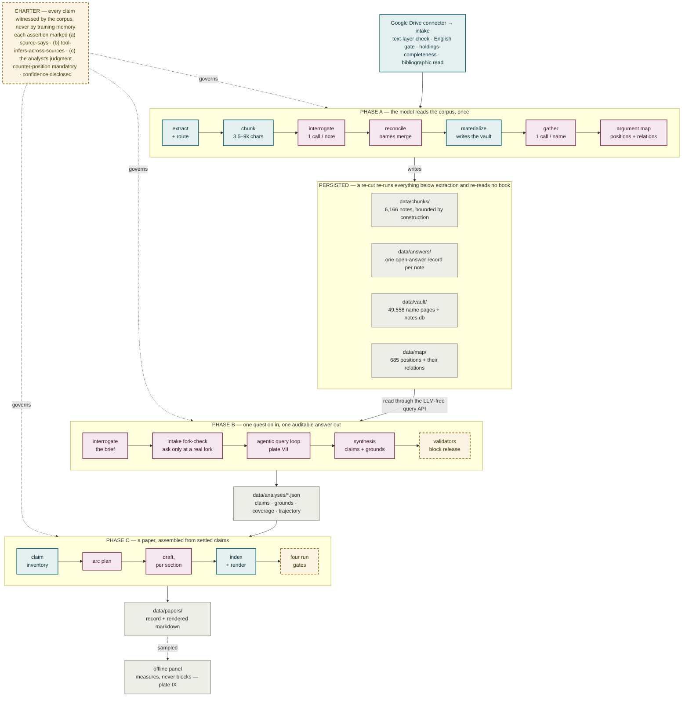

# Plate I — The whole system

**What it shows.** The corpus is read once and written down; every later phase reads
artifacts, not books. Model calls concentrate in six places, and each sits between
deterministic code on the way in and a gate on the way out.

## Notes

- **Phase A is the substrate, not the product** (`specs/CHARTER.md` §0). It builds the
  corpus the reasoning layers stand on; the product is Phase B–E.
- **The charter is never patched into a phase spec.** Every phase spec cites it and
  derives its P0 criteria from the five principles.
- Phases A, B and C are built. **D (format adaptation) and E (lens application) are
  GitHub milestones, not a schedule** (DEC-63) — no spec, no date, no issue.
