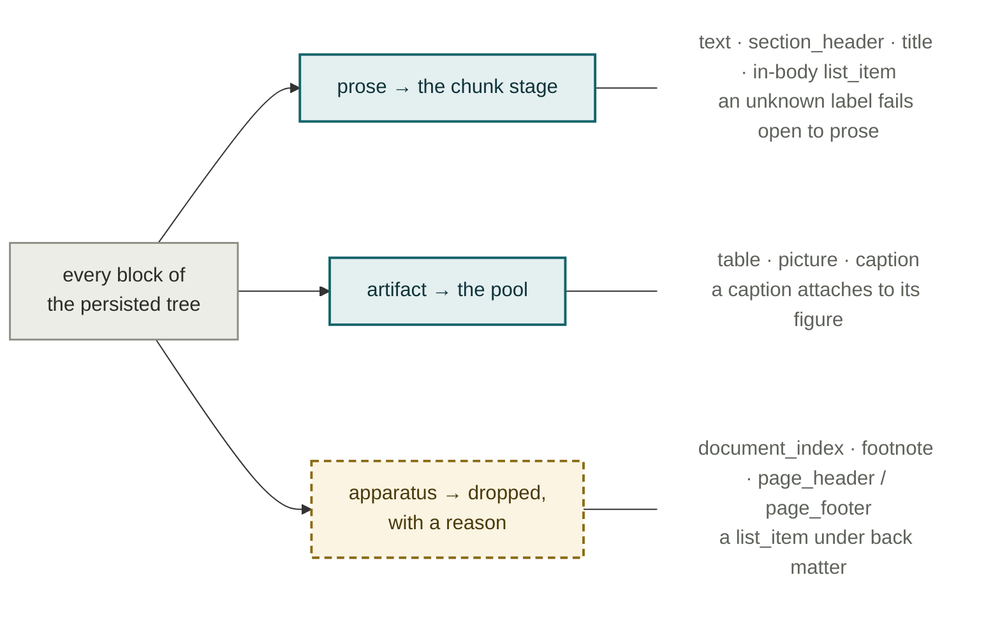

# Plate II — The Phase A ingestion ledger

**What it shows.** Ten stages, what each costs in model calls, and what it leaves on
disk. The two expensive rows are stage 6 (once per note) and stage 9 (once per name).
Everything else is free or once per source.

| # | Stage | Model calls | Writes |
|---|---|---|---|
| 1 | Intake — text layer, language, holdings, bibliography | 1 per source | `data/source_meta/` |
| 2 | Extract (docling) → normalize text → route | 0 \* | `data/trees/` |
| 3 | Envelope — thesis, scope, stated argument, TOC | 1 per source | `data/envelopes/` |
| 4 | Chunk — recursive / structural, band `[3500, 9000]` | 0 | `data/chunks/` |
| 5 | Artifacts — tables, figures, captions | 0 | artifact pool |
| 6 | **Interrogate** — fourteen open questions, one reading | 1 per note (~6,100) | `data/answers/` |
| 7 | **Reconcile** — inventory, fold, cluster, merge | 1 per merge batch | `data/names/` |
| 8 | Materialize — name pages, prose notes, note store | 0 | `data/vault/` |
| 9 | **Gather** — what the authors at a name disagree about | 1 per name + merge | `disagreements.jsonl` |
| 10 | Pairwise verbatim support — optional | 1 per pair | on demand |

\* plus one bounded call per block on the small set of content-flagged apparatus
candidates. Clean prose never reaches it.

## Step 2b — the source router

One classification, made once and consumed by every later pass. No pass re-derives the
prose / non-prose decision for itself.

## Notes

- **The router never drops on uncertainty.** Every drop is recorded with its reason in
  the router-owned skip record, which is what makes a deliberate drop distinguishable
  from a silent loss — the sidecar-less form of this guard lost 34 legitimate chunks
  with no trace across the 2026-07 corpus rerun.
- **Call-count effect.** v0 ran ~56,000 note-level calls. v1 runs roughly 6,000: a 9,000
  character cap yields about a third as many notes, and each is read once.
- **The structural tree is extracted once per source and reused.** A source is
  re-extracted only when no persisted tree exists for its `source_id`, which is what
  makes a full re-cut hours rather than days.
