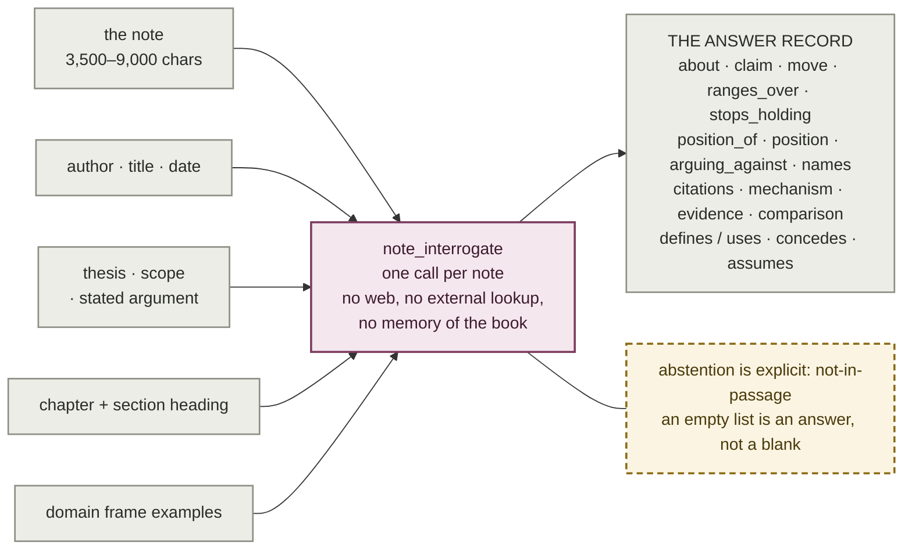
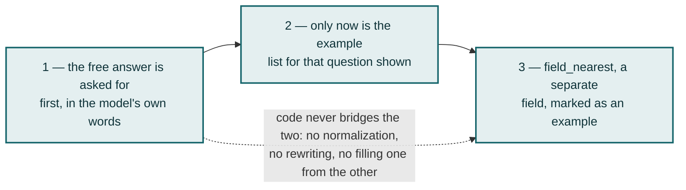
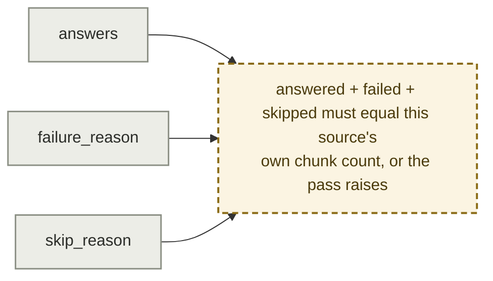

# Plate III — Interrogate

**What it shows.** One reading per note, fourteen open questions, and an explicit right
to abstain. Closed vocabularies return bins; open questions return specifics, and
specifics are what two passages can share.

## The ordering that keeps the examples from capturing the answer

The single biggest regression risk in the feature: if the interrogation answers in the
frame's vocabulary, v1 has rebuilt tagging with more values and failed silently.

## Three record kinds, one file per source

## Notes

- **A guessed answer is worse than an abstention**, because nothing downstream can tell
  it from a read one. Every field is in exactly one of three states, and the states are
  distinguishable by reading the record.
- **The file is also the resume point.** A note already carrying any of the three kinds
  is never re-sent to the model.
- **`names` is where cross-book edges come from**; `citations` is the author's own
  cross-book edge, available from the first reading and never looked for by any v0 pass.
- **The corpus is a permanent mixed frame.** A record written before frame 0.2 carries
  `position_of` and no `position` key. Every reader branches on **key presence**, never
  on the `frame_version` string.
- Per-question yield is measured: only `stops_holding` is broadly refused (60.2%), and
  `position` exists on 585 of 6,733 notes before the targeted backfill.
