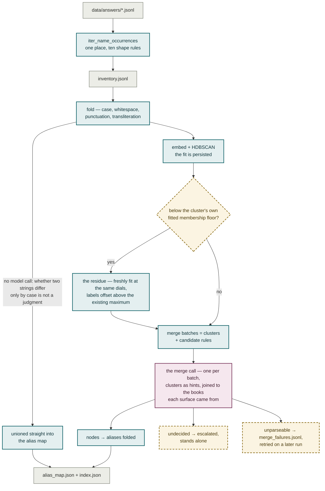

# Plate IV — Reconcile

**What it shows.** Three tiers of decision, kept apart on purpose: a string fold decides
alone and never asks; clustering only chooses what is put in front of the model at once;
the model makes every merge, and may say it cannot tell.

## Notes

- **The cut set is a filter, not a lossless record.** Rows A–S drop citation-only
  surfaces, back matter, dates, locators and bare numerals: 61,612 surfaces → 44,382
  pages. A page disappears only when **every** surface that would have been its member
  matches.
- **Clustering is a viewing aid.** It decides nothing; it only chooses how much is put in
  front of the model at once. The dial is moved by reading the distribution report —
  start loose, tighten by looking.
- **The candidate rules refuse on ambiguity.** `C. Tilly ↔ Charles Tilly`,
  `Abercrombie ↔ Nikolas Abercrombie`, `(AANS) ↔ its expansion` — and every rule proposes
  nothing the moment a short form has more than one candidate.
- **A surface already seen keeps its label and its vector.** Only a genuinely new one is
  placed, by `approximate_predict`, and only when its strength clears that cluster's own
  fitted floor. Existing labels are never renumbered. This took merge re-asks from 5,143
  to 2,202 on an incremental build.
- **Every merge is reversible data.** Nothing else on disk records that a merge happened,
  so deleting one node undoes exactly that merge. `merge_decisions.jsonl` is keyed on the
  batch's rendered members, so a re-run reproduces the same merges for free.
- **"Cannot tell" is a third outcome, not a default.** An escalated surface stands alone
  — the same place an unplaced one stands — but the two are distinguishable on disk, so
  the rate is measurable.
