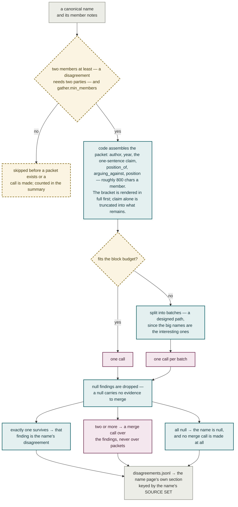

# Plate V — Gather

**What it shows.** For every name big enough to hold an argument: what do the authors
gathered there actually disagree about? The model never fetches, so the pass cannot blow
the context window. The budget is a constant in code rather than an instruction in the
prompt — a prompt-side budget is a request, a code-side budget is a guarantee.

## Notes

- **The two gates are different in kind.** Two members is definitional and never moves —
  one note has no second author to disagree with. `gather.min_members` (default 10) is a
  movable product-scope choice, exposed in config: cutting at 10 drops 90% of the pages
  and keeps 52% of the member evidence, because the value concentrates where the volume
  does not.
- **The budget is two constants, not one** — a per-member cap and a whole-block budget.
  The per-member cap is what makes the block budget arithmetic rather than an average,
  so the guarantee holds for *any* name at *any* corpus size.
- **Reserving the bracket first is measured.** Truncating the whole rendered line instead
  cost `arguing_against` entirely on 22.4% of packets — the one clause that separates
  contested names from uncontested ones.
- **A merge call handed real evidence never honestly returns null**, so a null merge is
  treated as a content-shaped failure and re-asked; if the budget is exhausted, code —
  not another model call — falls back to the surviving findings' own text.
- **Keyed by the source set, not the rendered packets.** A 200-note page gaining its
  201st note from an author already in the room cannot change who is arguing with whom.
  Of 1,128 names one incremental run re-asked under the old key, 615 (55%) contained no
  note from any of the new books at all.
- **Gather does not reproduce.** Two numbers, two frames, and they must not be traded for
  each other. On *byte-identical* input the pass returns a different answer for 19.3% of
  names, and 36.1% of the disagreements it recorded come back null (#700, n=150). Under a
  *changed* packet — one book's rendered author relabelled — 53% of decided calls reversed
  (#495, n=176), which is why the write loop keeps a name's newest non-null record rather
  than the record under its current key. This is why a finding is a retrieval hint
  downstream and never a citation.
