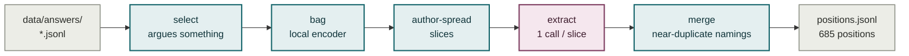
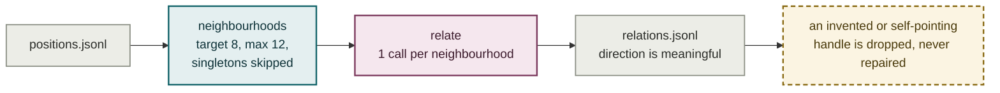

# Plate VI — The argument map, built

**What it shows.** Name-keyed retrieval only reaches a passage through a proper noun it
happens to mention. The position layer groups passages that make the same argument, once
and offline, so a question can land on the argument directly. Both model passes here are
deliberately blind to authorship.

## Stage 1 — positions

Selected: a claim that is not abstained, sitting before its source's back-matter
boundary, not itself a front/back-matter section by heading, and not silent on all six of
`mechanism`, `comparison`, `concedes`, `assumes`, `position_of`, `ranges_over`.

## Stage 2 — relations

## Three things that look like details and are not

| | |
|---|---|
| **Blind on purpose** | The extraction prompt shows a bare handle and the claim, never the author — so the later cross-author balance count measures the corpus and not its own input. |
| **No menu of relation types** | The model coins its own label and says what the relation is. An engine told to look for opposition finds opposition: opposition came back at 6.6% precisely because nothing asked for it. "Unrelated" stays cheap to say. |
| **The pin hashes raw sources only** | A prompt, model or reasoning-tier change does not force a rebuild; a corpus change does. Two ledgers are flushed the instant a call returns, so no paid call is ever lost. |

## Notes

- **The grain is a stated choice, not a fitted one.** The same corpus yields 1,636
  positions at a tight threshold and 234 at a loose one. No correct number is hiding in
  the data.
- **The extraction call is told that producing roughly as many arguments as passages is a
  failed read** — the job is what recurs across passages, not a restatement of each.
- **Relations key on `position_id`, never on the argument sentence.** A sentence-keyed
  rejoin silently drops any relation whose sentence was not unique across positions.
- **All-pairs is never done.** A flat clustering at real-corpus scale produced a
  53-position group — 1,378 possible pairs in one call, which the model cannot weigh and
  which alone would dominate the denominator.
- **Measured:** 705 calls, 45 minutes at 20 workers, $0.75 for both stages on 31 sources.
  The map scales roughly linearly (k = 1.04) but densifies: cross-book arguments went
  from 8.7% to 38.4% and have not plateaued.
- **A passage already placed keeps its bag** (`bag_state.json`), which took an
  incremental build from 665 reads asked down to 148.
