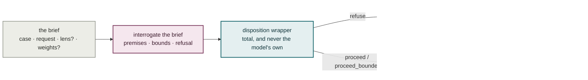
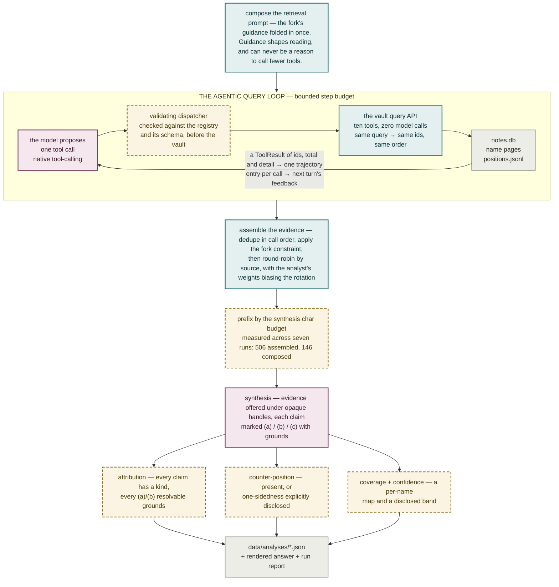

# Plate VII — The Phase B agentic query loop

**What it shows.** The one genuinely agentic loop in the system, and the shape of the
whole architecture: the model plans and re-queries freely in the middle, and code it
cannot reach stands on both sides. A fixed retrieval pipeline was rejected because thin
results demand a second look only an agent can decide to take.

## Intake — before the agent runs

## The loop, and the deterministic reduction after it

## Notes

- **The feedback states composition and nothing else.** What the evidence set now holds
  and which books it spans, plus every returned id's own author, year and one-sentence
  claim. Never the budget, the cap or what would still fit: a cap the model can see gets
  widened on purpose.
- **And never "you already asked this."** Telling the model so was measured to *raise*
  repeats, 14% → 20%. The fix belongs in the resolver, not the memory.
- **What the tools return.** Notes, opposition edges and argument-map positions are the
  destination; a name, a publication year and a source are filters on them — WHERE
  clauses, never the destination. The entry point is `find_notes`, not a door lookup: a
  historian's question chains two relations and every name-layer tool walks exactly one.
- **An empty result is a real answer.** A tool that resolved nothing says the phrase it
  tried and each of its words, so a zero has somewhere to go other than the same query.
- **Opaque handles, not real ids.** The synthesis prompt never shows a real `chunk_id`;
  each evidence chunk is offered under a short per-call handle resolved by exact lookup.
  There is no long id in the prompt to transcribe, truncate or blend.
- **A failed mechanical check blocks release.** Where a check is genuinely not mechanical
  — does a cited chunk actually support the claim, is a counter-position steelmanned —
  it is a bounded separate call, never the generating model grading itself.
- **Retrieval precision measured against what was *composed*, not what was assembled:**
  506 assembled → 146 composed → 103 cited is 70.5%, not 20%.
