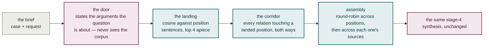

# Plate VIII — Retrieval over the argument map

**What it shows.** An opt-in path (`--map`) that replaces stage 3 of plate VII and
nothing else: same lens, same synthesis prompt, same char budget, same model. If an
answer improves on this path, the improvement is the substrate and never a changed
prompt.

| | |
|---|---|
| **The encoder is checked, not assumed** | A cosine between two different embedding spaces returns a number and never raises on its own, so a mismatch is a stated refusal. |
| **It makes no tool call** | So it produces no trajectory — an honest empty list, with the record carrying a `map_retrieval` audit trail instead: the pin read, the stated arguments, the landed positions, the corridor, the assembled ids. |
| **The opposition arrives on its own** | A corridor position is reached because it argues with what landed, never because the brief happened to name it. |

## Notes

- **The door is blind to the corpus on purpose.** It states what the question is about
  before anything shows it what happens to be there — which is precisely the failure this
  arm exists to escape one layer up.
- **Neither landing number is a knob awaiting a sweep.** Widening top-`k` from 2 to 24
  left the composed-books count flat, because assembly's first rotation already covers
  the whole synthesis budget. Spreading the landing across authors instead of by score
  was measured *worse*: 19 landed positions → 11, three books dropped entirely.
- **Measured stronger than the name layer on grounding** — strong vs adequate, half the
  defects, on 4 sources cited rather than 8. A drop in sources-cited is not a regression
  here.
- **`confidence` reports `not_measured`, never `low`,** on this path: the coverage map is
  per-name and this path queries no name. A `low` band is a real measurement's answer and
  must not stand in for silence.
- **Nothing about the name-layer loop is retired for this.** `--map` is off by default.
