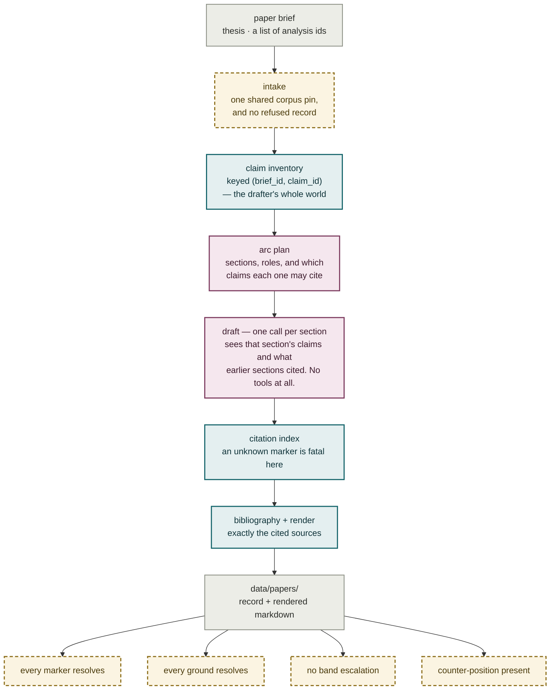
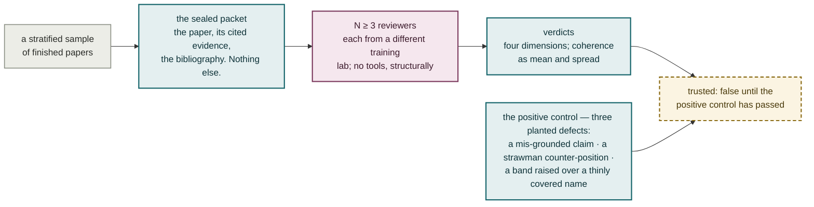

# Plate IX — Phase C authorship, and the strangers who measure it

**What it shows.** Two halves on two different clocks. The paper is assembled and gated
on every run; the system is measured on a sample, by reviewers from a different training
lab, and only after a positive control proves the panel is still reading.

## The per-run pipeline — cheap, and run on every paper

**The drafter cannot introduce evidence, because it has no path to any.** It has no
retrieval tools and no vault access: the claim inventory is the whole world.
Generate-then-cite is made structurally impossible rather than forbidden by instruction.

## Off the pipeline, on its own clock — measures the system, holds back no paper

## Notes

- **Why a panel at all.** Every property cheap to check is checked on every paper. The
  one none of them reach — whether the argument holds together — is measured, on a
  sample, and gates nothing.
- **Isolation is enforced by the harness that builds the call**, not by anything written
  in the prompt: a model with file tools reads the repository regardless of what its
  instructions say. Isolation you ask for is not isolation.
- **No tools, structurally.** Reviewers dispatch through the plain completion seam, which
  has no `tools` parameter to pass — stronger than a check that can be forgotten.
- **Vendor means the lab that trained the model**, never the API provider that serves it.
  A model id absent from the table is a hard error, never assumed distinct.
- **A plant that cannot be applied is an error, never a skip.** A control that quietly
  plants two defects and then passes is worse than no control at all.
- **The dependency runs one way.** `panel/` learns to read a paper record; the pipeline
  never learns that a panel exists. Nothing under `paper/` may import from `panel/`.
- **Run every brief a paper will draw on inside one pin window.** A Gather run, a name
  merge or a materialize that changes which pages exist all move the corpus pin, and a
  paper across two pins is rejected at intake.
- **Release bar met 2026-08-02:** both papers pass all four gates, 7 new (b) claims,
  $0.12–0.16 a paper.
